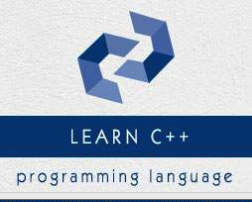

```
Roberto Nogueira  
BSd EE, MSd CE
Solution Integrator Experienced - Certified by Ericsson
```
# Tutorialspoint C++ Tutorial



**About This Tutorial**

This is to grasp rapidly the language and its concepts.

[C++ Tutorial](https://www.tutorialspoint.com/cplusplus/index.htm)

#### Topics
```
C++ Basics
[x] C++ Home
[x] C++ Overview
[x] C++ Environment Setup
[x] C++ Basic Syntax
[x] C++ Comments
[x] C++ Data Types
[x] C++ Variable Types
[x] C++ Variable Scope
[x] C++ Constants/Literals
[x] C++ Modifier Types
[x] C++ Storage Classes
[x] C++ Operators
[x] C++ Loop Types
[x] C++ Decision Making
[x] C++ Functions
[x] C++ Numbers
[x] C++ Arrays
[x] C++ Strings
[x] C++ Pointers
[x] C++ References
[x] C++ Date & Time
[x] C++ Basic Input/Output
[x] C++ Data Structures

C++ Object Oriented
[x] C++ Classes & Objects
[x] C++ Inheritance
[x] C++ Overloading
[x] C++ Polymorphism
[x] C++ Abstraction
[x] C++ Encapsulation
[x] C++ Interfaces

C++ Advanced
[x] C++ Files and Streams
[x] C++ Exception Handling
[x] C++ Dynamic Memory
[x] C++ Namespaces
[x] C++ Templates
[x] C++ Preprocessor
[x] C++ Signal Handling
[x] C++ Multithreading
[x] C++ Web Programming

C++ Useful Resources
[ ] C++ Questions and Answers
[ ] C++ Quick Guide
[ ] C++ Object Oriented
[ ] C++ STL Tutorial
[ ] C++ Standard Library
[ ] C++ Useful Resources
[ ] C++ Discussion

Selected Reading
[ ] Developer's Best Practices
[ ] Questions and Answers
[ ] Effective Resume Writing
[ ] HR Interview Questions
[ ] Computer Glossary
[ ] Who is Who 
```

